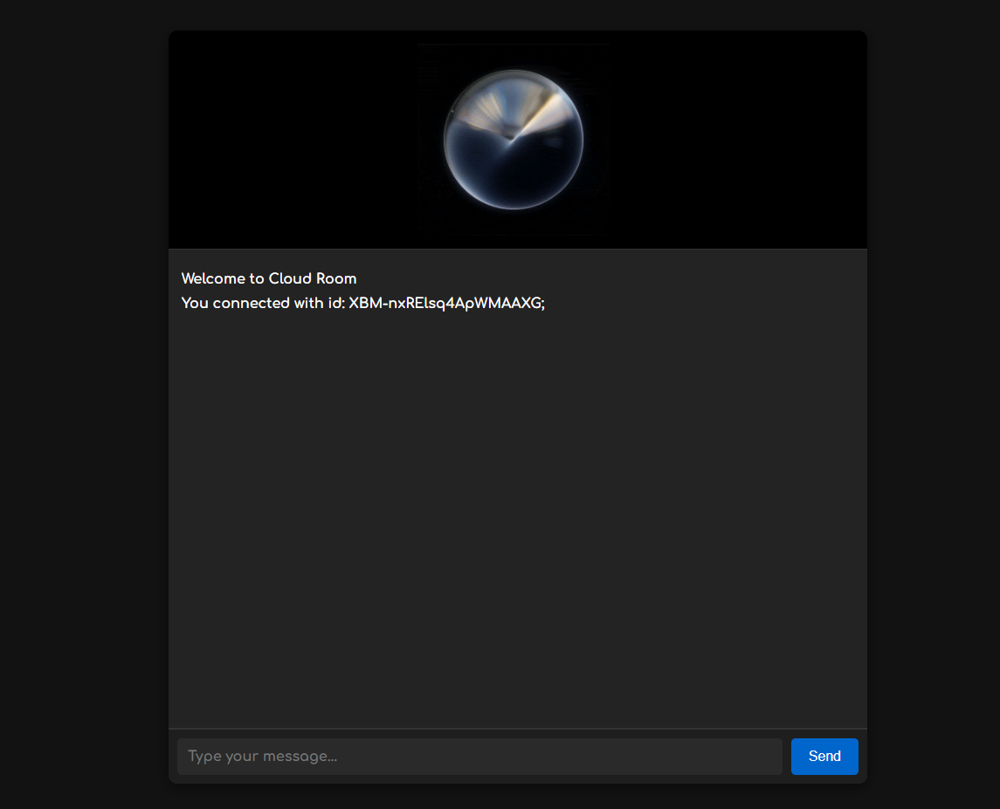

# Cloud Room

Cloud Room is a sleek and secure chatroom application designed for private and real-time communication. It’s the perfect solution for those who value simplicity, confidentiality, and comfortable chatting environment.
    

## Usage

Cloud Room is a secure and modern chatroom application tailored for private and real-time communication. Whether you're engaging in confidential discussions, collaborating with a team, or simply chatting with friends, Cloud Room offers a seamless and user-friendly experience. The app utilizes Socket.IO, a powerful technology for real-time, bidirectional communication between the client and server, ensuring instant message delivery. Built with Express for a reliable back-end, and crafted using HTML, CSS, and modern JavaScript (ES6+), Cloud Room features a sleek dark-themed design. Its private room functionality and responsive interface make it an excellent choice for users who value privacy, efficiency, and style.

## License

This project is licensed under the MIT license.